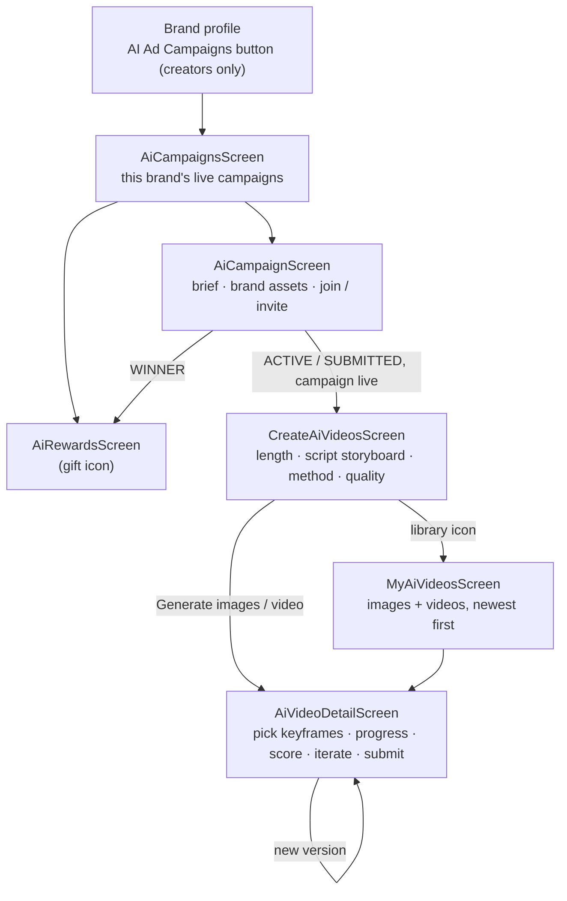
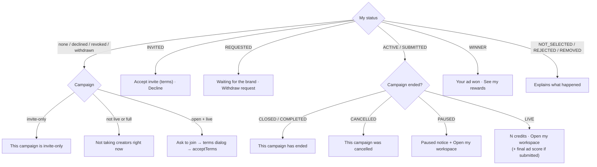
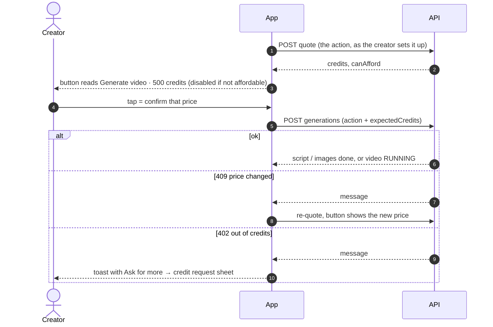
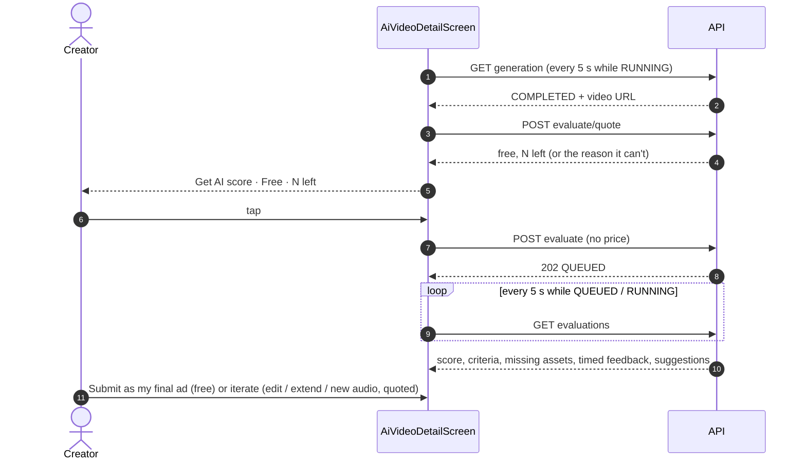
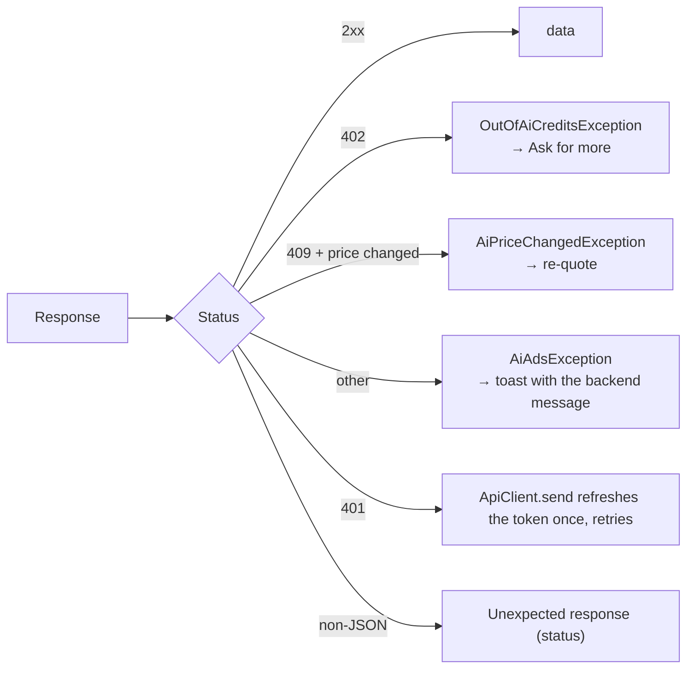

# AI Ads (creator side)

Brands fund AI ad campaigns; creators join one and make an ad with AI tools
using the brand's credits. The backend owns everything (campaigns, pricing,
the credit ledger, generation, scoring) — backend ADRs 111–115 and
`docs/features/ai-ad-campaigns.md` there. Why the client looks the way it does:
[ADR 030](../decisions/030-ai-ads-ui-wired-to-backend-campaigns.md).

## Where it lives

| Piece | File |
| --- | --- |
| API client + models | `lib/core/services/ai_ads_service.dart` |
| Status-preserving request | `ApiClient.send` → `ApiResponse` (`lib/core/services/api_client.dart`) |
| Campaign list (all / one brand) | `lib/features/ai_ads/screens/ai_campaigns_screen.dart` |
| Campaign: brief, assets, join | `ai_campaign_screen.dart`, `ai_brand_assets_row.dart` |
| Workspace: scripts → create | `create_ai_videos_screen.dart` |
| One image set / video | `ai_video_detail_screen.dart` |
| My images + videos | `my_ai_videos_screen.dart` |
| Rewards | `ai_rewards_screen.dart` |
| Shared bits | `widgets/ai_ui.dart`, `ai_dialogs.dart` (terms, credit request, edit script), `ai_job_status_badge.dart`, `ai_video_player.dart` |

Entry point: the **AI Ad Campaigns** button on a brand's profile, shown only to
users whose profile `role` is `creator`.

## Flow

1. **Join** — open campaigns: *Ask to join*; invite-only: *Accept invite*.
   Both show the ownership-terms dialog first and send `acceptTerms: true`.
   A request waits for the brand's approval (`REQUESTED` → `ACTIVE`).
   **Your images & videos** — once anything exists, the workspace opens with a strip
   of everything made (image sets with their first image + count, videos, a spinner
   while generating), newest first; tap to open it, *See all* for the full list.
2. **Length first** — the *Length* chips sit above the script: the script **and**
   the video are made for it. *Write with AI* / *Refine with AI* send it as
   `settings.durationSeconds`; the backend makes the scene timings add up to it.
   Picking a script version selects the length it was written for.
3. **Script** — *Write with AI* (paid), *Refine with AI* (paid), *Use my text*
   (free) or *Edit* an existing version (free; creates a new version). Each
   script button shows its price in a pill on the right (`⚡ 3 credits` / `Free`,
   `AiSecondaryButton.price`), and a disabled button greys out but stays readable.
   The selected script shows as a storyboard (`AiScriptView`): title + total
   length, the hook, one card per scene on a timeline (`0–3s`, the visual, the
   voiceover, the on-screen text, brand cues), then the call to action. A
   hand-written script shows as plain text.
4. **Create** — *Text to video* (length + quality) or *Images first*: a
   **storyboard** (`perScene: true`) — one keyframe per scene of the script, each
   labelled "Scene 2 · 3–7s" and all picked by default (untick one to let the AI
   improvise that scene) → video. Every image carries a **number** (1, 2, 3).
   *Change images*: tap any number of images, say what to change in each, *Update 2
   images · N credits* → only those are redone (billed per image) and a new version
   opens. Versions are counted **per image**: v1 is that image's original, v2 its
   first edit, … — so the numbers line up whichever set an edit was made in. Any image
   that isn't its original carries **Edited · v2**, and each image with more than one
   version shows a **version switcher** (v1 · v2 · v3); the video and any further edits use the version
   showing in each slot (`slotSources`). The length is fixed by the script here
   ("10s · set by your script").
   When the selected script already has a storyboard, *Images first* shows it
   ("Your storyboard for this script is ready — Images v3, 3 images") with **Open your
   storyboard** as the main action; *Make a new storyboard · N credits* is secondary,
   so a creator never pays for a new set by accident. The video pins each frame to its scene's time,
   and its length defaults to the script's. Length chips are the brand's min / middle / max,
   plus a **5s first take** (the workspace's `shortClipSeconds`) when the brand's
   minimum is longer. Picking it shows a hint that the clip can be extended — a shorter ad may still be submitted (product decision). Videos run in the background; the detail screen
   polls every 5 s and offers *Cancel (refunded)*.
5. **Judge** — *Get AI score* (**free** — the platform pays — up to a number per creator per
   campaign, shown as "Free · N left"; a background job). The score card shows the
   0–100 score, per-criterion scores, missing mandatory brand assets, forbidden
   claims / safety issues (these cap the score), timed feedback and
   suggestions. A failed evaluation doesn't count and can be retried; a video that was already
   judged can't be judged again (change it first). When none are left, the backend's reason is
   shown and the button is off.
6. **Iterate** — *Edit*, *Make it longer* (+4/5/8/10 s) or *New audio* on any
   finished video (paid, quoted).
7. **Submit** — *Submit as my final ad* (free, changeable until the deadline).
   The brand picks winners; rewards show under *My rewards*, where the creator
   confirms *I got it*.

## Diagrams

The backend's `docs/features/ai-ads-architecture.md` has every server-side flow (credits,
pricing, margin, state machines, jobs). These are the app's flows.

### Screens

### What the campaign screen offers

### A paid action (scripts, images, videos)

### A video, and getting it judged

### Errors the app handles

## Money rules the client must keep

- **Never show a price the server didn't quote.** Every paid button label is
  the latest `POST …/workspace/quote` result, and the button is disabled until
  it arrives or when `canAfford` is false. Prices are what the AI providers
  charge plus the platform's margin, synced by the backend (backend ADR 116) —
  the app holds no pricing logic.
- **Send the price the creator saw** as `expectedCredits`. The server refuses
  to charge more (409 "The price changed…") — re-quote and let them tap again.
- **402** means nothing ran and nothing was charged — offer *Ask for more*
  (credit request; the brand reviews all the creator's activity first).
- **Evaluation is free** (`credits: 0`, `free: true`, `freeEvaluations`
  `{limit, used, left}`); the request sends no price. The workspace shows how
  many free evaluations are left. ([ADR 031](../decisions/031-ai-ads-free-evaluation.md))
