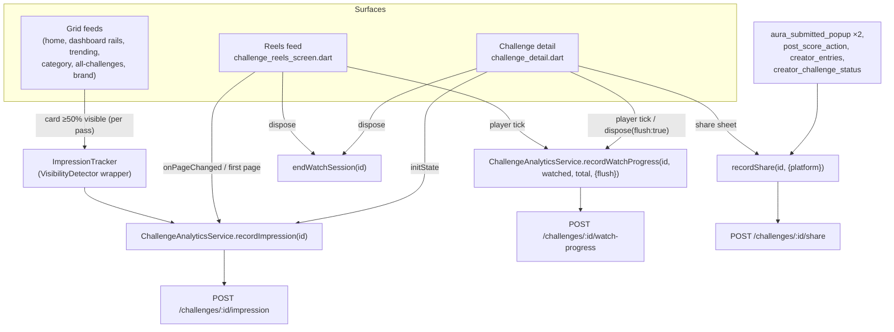
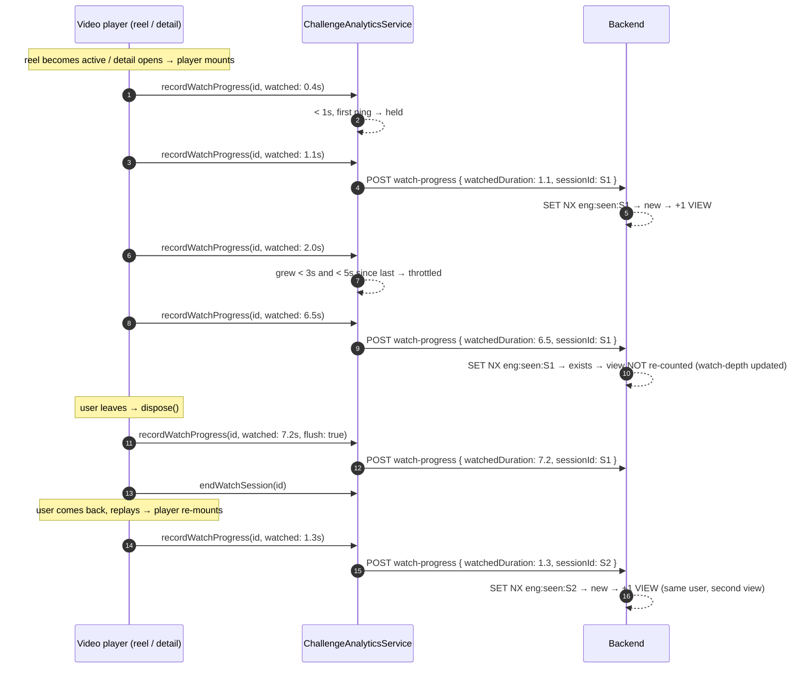

# Engagement reporting (impressions, views, shares)

How the Flutter client tells the backend that a challenge was **seen**,
**watched**, or **shared**. This is the client side of a contract the backend
owns — the canonical definitions live in the backend repo
([backend ADR 090](http://144.91.79.237:5173/decisions/090-engagement-metrics-and-redis-buffered-counters),
`docs/features/engagement-metrics.md` there). This page is what a client dev
needs.

Decisions behind it: [ADR 012](../decisions/012-client-side-challenge-view-share-watch-reporting.md)
(original), [ADR 018](../decisions/018-engagement-reporting-realigned-to-backend-adr-090.md)
(realigned to the definitions below), [ADR 019](../decisions/019-feed-impression-instrumentation-visibilitydetector.md)
(grid-feed instrumentation).

---

## ⚠️ Core rule — one user, many views and impressions per login

A single logged-in user produces **many** views and **many** impressions in one
session. Watch challenge A, go to challenge B, come back to A → **two views**,
not one. Same for impressions on every re-scroll / revisit. The client must
**never** de-dupe engagement per user or per app session — it sends every
sighting and every play. The only collapse is the backend's, *within one
uninterrupted play* (same `sessionId` → one view). This client's job:

1. `recordImpression` on **every** on-screen sighting (no `_impressed` set — removed in ADR 018).
2. A **fresh `sessionId` per player mount** (`_WatchState`, dropped by `endWatchSession`) so each play is its own view.
3. `recordVideoView(id)` the instant a player starts — it sends the session's first `watch-progress` ping (`watchedDuration: 0`), which the backend records as one view. Seeing the video is the view; no minimum watch time.

---

## Definitions

| Term | Means | De-dup | Endpoint |
| --- | --- | --- | --- |
| **Impression** | the challenge's video appeared on the user's screen — any feed, the reels feed, or the detail page. Counts even on a sub-second scroll-past. | **none** — every sighting | `POST /challenges/{id}/impression` |
| **View** | the challenge's **video was shown** to the user (a player mounted and played it). `view ⇒ an impression happened too`. No minimum watch time. | **one per play session** (`sessionId`) | `POST /challenges/{id}/watch-progress` |
| **Play session** | one `sessionId`. Minted when a player mounts — a reel becoming the active page, the detail screen opening, tapping replay. Pause/resume is the **same** session. Ended by `endWatchSession()` on the player's `dispose()`. | — | — |
| **Share** | the OS share sheet was invoked for a challenge. | none — raw count | `POST /challenges/{id}/share` |

- One authenticated user can produce **many** impressions and **many** views
  (scroll away and back; replay). There is no per-user cap.
- The backend absorbs views/impressions into Redis and flushes to Mongo
  **~every 60s**, so the creator/brand analytics screens lag real activity by
  up to a minute. Shares are written straight to Mongo (a deliberate action,
  not scroll telemetry).
- "View" is **not** "distinct watcher" — the backend reports distinct watchers
  and watch-depth (`completionPercentage`, buckets) separately off the same
  `watch-progress` pings.

---

## The client pieces



### `ChallengeAnalyticsService` (`lib/core/services/challenge_analytics_service.dart`)

A fire-and-forget singleton. **Every method** is `unawaited`, never throws,
never blocks the caller, and swallows any transport/parse error — analytics
must not be able to break a screen.

| Method | Behaviour |
| --- | --- |
| `recordImpression(id)` | POSTs on **every** call. No de-dup (removed in ADR 018). Caller decides what "seen" means. Body: `device` (`android`/`ios`/`web`/`unknown`, from `defaultTargetPlatform`). |
| `recordVideoView(id)` | Call the instant a challenge video starts playing. Sends the session's first `watch-progress` ping (`watchedDuration: 0`) → the backend records **one view**. Idempotent within a play; a fresh mount (after `endWatchSession`) sends again. |
| `recordWatchProgress(id, {watched, total, flush})` | The **first** ping of a session always sends immediately (that is the view). Later pings are throttled to "grew ≥ 3s **and** ≥ 5s since the last send"; `flush: true` overrides the throttle. Negative `watched` sends nothing. Body: `watchedDuration` (s), `videoDuration` (s, omitted if `total` null/zero), `sessionId`, `device` — the last drives the 360°/creator/brand "Device Distribution" section (backend ADR 093), persisted on `ChallengeWatchAnalytics.device`. |
| `endWatchSession(id)` | Drops the session so the next play mints a fresh `sessionId` → a new view. Call from the player's `dispose()`, and (reels) when scrolling off a page. |
| `recordShare(id, {platform})` | POSTs on every call. `platform` is sent when given (backend accepts but does not yet store it). |

### `ImpressionTracker` (`lib/shared/widgets/impression_tracker.dart`)

`VisibilityDetector` wrapper for grid-feed cards. Fires `onImpression` once
per pass when the card first reaches `threshold` (0.5) visible; **re-arms**
when the card goes fully off-screen so a later sighting fires again. `enabled:
false` renders the child with no detector mounted.

```dart
ImpressionTracker(
  detectorKey: ValueKey('imp-$challengeId'),          // stable + unique per item, NOT the index
  onImpression: () => ChallengeAnalyticsService().recordImpression(challengeId),
  child: ChallengeCard(...),
)
```

---

## Play-session / view lifecycle



---

## Call sites

| Signal | Fired from |
| --- | --- |
| impression | `challenge_reels_screen.dart` (`onPageChanged` + first page), `challenge_detail.dart` (`initState`); grid feeds via `ImpressionTracker` — see [ADR 019](../decisions/019-feed-impression-instrumentation-visibilitydetector.md) for the rollout list |
| watch-progress | `challenge_reels_screen.dart` (`_ReelPage` player), `challenge_detail.dart` (controller listener + `dispose` flush) |
| share | `challenge_detail.dart`, `creator_challenge_status_screen.dart`, `aura_submitted_popup.dart` (×2, one with `platform: 'instagram_story'`), `post_score_action_screen.dart`, `creator_entries_screen.dart` |

---

## Testing

| File | Covers |
| --- | --- |
| `test/core/services/challenge_analytics_service_test.dart` | impression fires every call (no de-dup); `recordVideoView` fires the first ping immediately + is idempotent per play + a new play sends again; first `watch-progress` ping always leaves; throttle after first ping; flush always through; `sessionId` stable per play, new after `endWatchSession`; negative-watched no-op; `videoDuration` omitted when absent; share payload; **transport failure never propagates** (thrown + 500) |
| `test/shared/widgets/impression_tracker_test.dart` | fires once on-screen; never while off-screen; in→out→in fires twice (re-arm); `enabled: false` renders child, no detector, never fires |

Manual check: run against the live backend, scroll a grid / open a reel /
watch it, confirm `POST …/impression` and `…/watch-progress` in the `[API]`
log, then (after ~60s for the backend flush) reload the creator analytics
screen and confirm Views / Impressions moved.

---

## Known gaps

- Grid-feed `ImpressionTracker` wiring is rolling out screen-by-screen
  ([ADR 019](../decisions/019-feed-impression-instrumentation-visibilitydetector.md));
  until a given grid is wrapped, a challenge only seen there records no
  impression (opening it still does).
- `platform` on `recordShare` is sent but not stored server-side yet.
- The `watch-progress` steady-state 5s-gap throttle isn't unit-tested (needs
  fake time); `flush` is.
