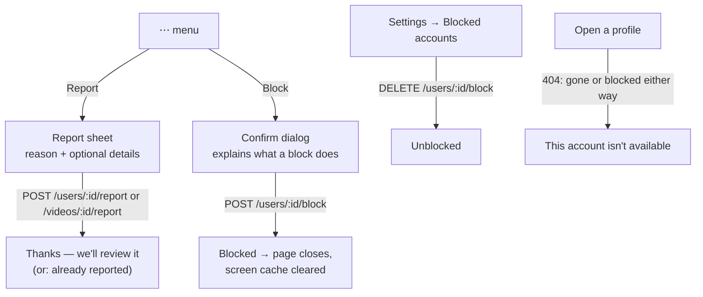

# Report & Block

Users can **report** an account (player, creator or brand) or a video, and **block** an
account. Product decisions and the server side are in the backend's ADR 117
(`user-reports-and-blocks.md`).

## Where it is in the app

| Place | What's there |
| --- | --- |
| Creator profile | `⋯` (top right, hidden on your own profile) → *Report account* · *Block …* |
| Brand profile | `⋯` next to share → *Report brand* · *Block …* |
| Challenge screen | The flag button opens a menu: *Report challenge* (existing), *Report video* (the challenge's video), *Block …* (whoever posted it; not for platform challenges or your own) |
| Settings → *Blocked accounts* | Everyone you blocked, with *Unblock* |

## How it works

- **Reasons** (`SafetyService.reasons`): spam, harassment, impersonation, inappropriate,
  scam, other. Details are optional (≤ 1000 characters). Reporting the same thing twice
  while it's open says it's already under review.
- **Blocking is two-way.** The other side can't see you either, and follows and friendship
  between you are removed. Blocking a brand also hides its challenges, ads and AI ad
  campaigns. The dialog says this before anything happens.
- **After a block or unblock**, `ScreenCache` is cleared so cached home, search and
  profile pages re-fetch without (or with) that account.
- **A blocked or removed profile** shows *This account isn't available* (`AccountUnavailable`).
  The API answers 404 for both cases, so the app can't tell them apart, and doesn't try to.

## Files

- `lib/core/services/safety_service.dart`: block, unblock, list blocked, report user or video.
- `lib/shared/widgets/safety_sheets.dart`: the menus, the report sheet, the block confirmation.
- `lib/shared/widgets/account_unavailable.dart`: the unavailable-profile view.
- `lib/features/account/screens/blocked_accounts_screen.dart`: Settings → Blocked accounts.

## Not covered

- The creator's legacy *Report Entry* on `CreatorEntriesScreen` still writes to Firestore,
  like that whole legacy screen. Moving it to `POST /videos/:id/report` belongs with that
  screen's migration to the REST API.
- The dead `_SubmissionReportSheet` (also Firestore, never shown) was removed.
